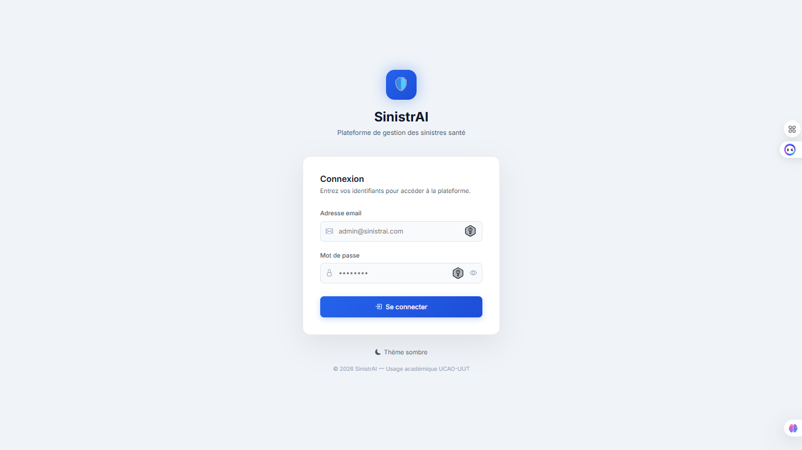
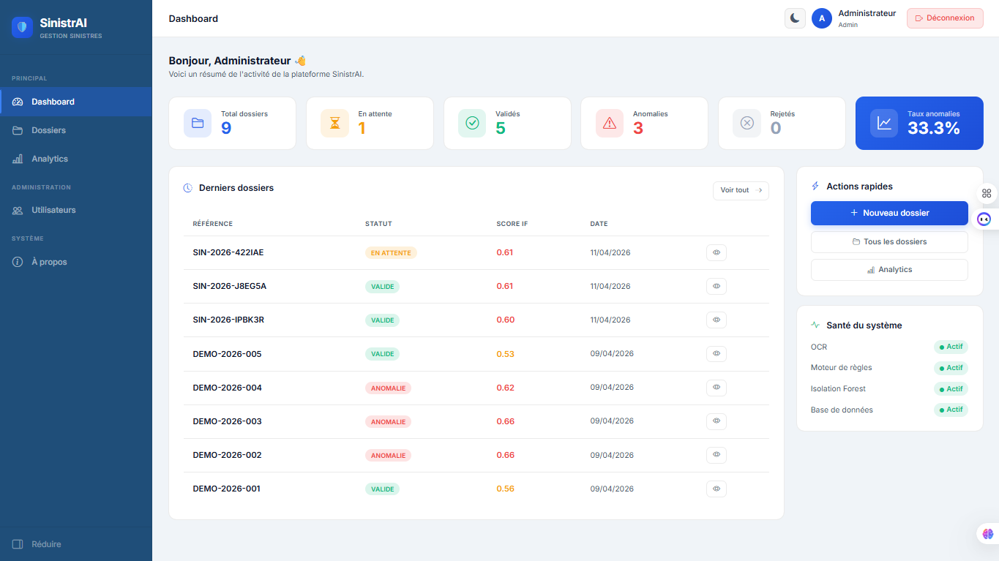
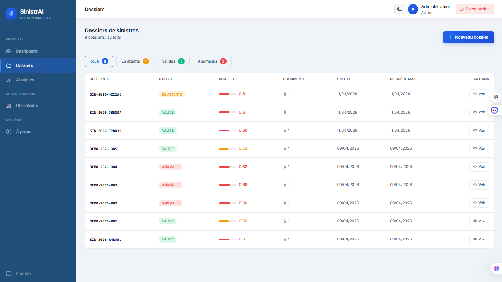
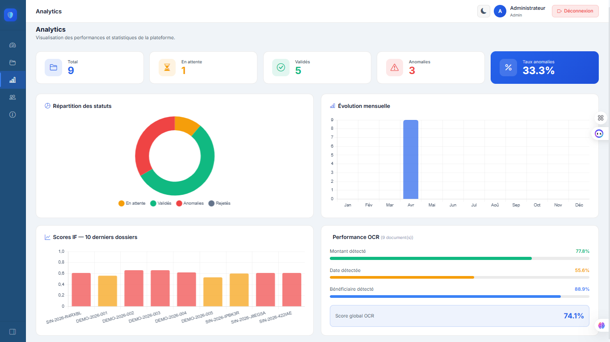
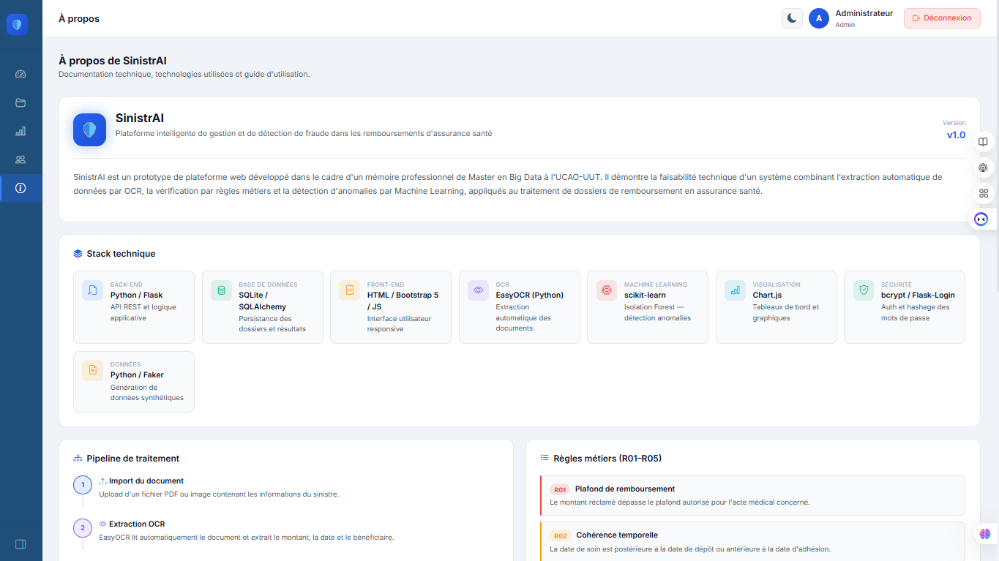

# 🛡️ SinistrAI

> **Plateforme intelligente de gestion et de détection de fraude dans les remboursements d'assurance santé**

Mémoire professionnel — Master en Big Data | UCAO-UUT | 2024–2025

---

## 📸 Aperçu

### Page de connexion


### Tableau de bord


### Gestion des dossiers


### Analytics


### À propos


---

## 📌 Description

SinistrAI est un prototype de plateforme web développé dans le cadre d'un mémoire professionnel de Master en Big Data. Il démontre la faisabilité technique d'un système combinant :

- 🔍 **Extraction automatique** de données via OCR (EasyOCR)
- ⚙️ **Moteur de règles métiers** — 5 règles de vérification automatique
- 🤖 **Détection d'anomalies** par Machine Learning (Isolation Forest)
- 📊 **Tableau de bord analytique** avec graphiques temps réel
- 👥 **Gestion multi-utilisateurs** avec rôles admin/gestionnaire

---

## 🏗️ Architecture

```
sinistrai/
│
├── app/
│   ├── __init__.py               # Initialisation Flask
│   ├── models.py                 # Modèles SQLAlchemy (5 entités)
│   ├── routes/
│   │   ├── auth.py               # Authentification & splash
│   │   ├── dossiers.py           # Gestion des dossiers
│   │   └── admin.py              # Administration utilisateurs
│   ├── services/
│   │   ├── ocr_service.py        # Extraction OCR (EasyOCR)
│   │   ├── rules_engine.py       # Moteur de règles métiers
│   │   ├── anomaly_detector.py   # Scoring Isolation Forest
│   │   └── logger.py             # Journalisation des actions
│   ├── static/                   # CSS, JS, images, favicon
│   └── templates/                # HTML Jinja2
│
├── data/
│   ├── generate_data.py          # Génération données synthétiques
│   ├── train_model.py            # Entraînement Isolation Forest
│   ├── init_demo.py              # Peuplement base de démo
│   ├── sinistres_synthetiques.csv
│   ├── isolation_forest.pkl      # Modèle entraîné
│   └── *.pkl                     # Encodeurs LabelEncoder
│
├── assets/
│   └── screenshots/              # Captures d'écran README
│
├── config.py                     # Configuration
├── run.py                        # Point d'entrée
├── Procfile                      # Déploiement Render
└── requirements.txt              # Dépendances
```

## ⚙️ Installation

### Prérequis
- Python 3.11+
- pip
- Poppler (pour la lecture des PDF)

### 1. Cloner le dépôt

```bash
git clone https://github.com/votre-username/sinistrai.git
cd sinistrai
```

### 2. Créer et activer l'environnement virtuel

```bash
python -m venv .venv

# Windows
.venv\Scripts\activate

# macOS / Linux
source .venv/bin/activate
```

### 3. Installer les dépendances

```bash
pip install -r requirements.txt
```

### 4. Installer Poppler (Windows)

Téléchargez Poppler depuis [ce lien](https://github.com/oschwartz10612/poppler-windows/releases/) et décompressez-le dans le projet. Mettez à jour le chemin dans `app/services/ocr_service.py` :

```python
POPPLER_PATH = r"chemin\vers\poppler\Library\bin"
```

### 5. Générer les données synthétiques et entraîner le modèle

```bash
python data/generate_data.py
python data/train_model.py
```

### 6. Lancer l'application

```bash
python run.py
```

### 7. Accéder à l'application

Ouvrez `http://127.0.0.1:5000` dans votre navigateur.

Identifiants admin créés automatiquement au premier démarrage :
- **Email** : `admin@sinistrai.com`
- **Mot de passe** : `admin123`

### 8. (Optionnel) Charger les dossiers de démonstration

```bash
python data/init_demo.py
```

---
## 🐳 Lancement avec Docker

### Prérequis
- Docker Desktop installé et lancé

### Clonez le projet

```bash
git clone https://github.com/nuvnce/SinistrAI
cd SinistrAI
```

### Démarrage en une commande

```bash
docker-compose up --build
```

L'application sera accessible sur `http://localhost:5000`

Identifiants admin :
- Email : `admin@sinistrai.com`
- Mot de passe : `admin123`

### Arrêter l'application

```bash
docker-compose down
```

### Arrêter et supprimer les données

```bash
docker-compose down -v
```
---

## 🚀 Fonctionnalités

| Fonctionnalité | Description | Statut |
|---|---|---|
| Authentification sécurisée | Login/logout avec hashage bcrypt | ✅ |
| Splash screen | Écran de bienvenue personnalisé | ✅ |
| Gestion des dossiers | CRUD complet avec filtres | ✅ |
| Import documents | Upload PDF/PNG/JPG | ✅ |
| Extraction OCR | EasyOCR — montant, date, bénéficiaire | ✅ |
| Règles métiers | R01 à R05 — 5 vérifications automatiques | ✅ |
| Détection anomalies | Isolation Forest — score 0 à 1 | ✅ |
| Tableau de bord | Statistiques temps réel | ✅ |
| Analytics | Graphiques Chart.js adaptatifs | ✅ |
| Double thème | Clair / Sombre avec persistance | ✅ |
| Gestion utilisateurs | Admin — création/modification/suppression | ✅ |
| Journalisation | Traçabilité complète des actions | ✅ |
| Page À propos | Documentation technique intégrée | ✅ |

---

## 🛠️ Stack technique

| Couche | Technologie | Rôle |
|---|---|---|
| Back-end | Python / Flask | API REST et logique applicative |
| Base de données | SQLite / SQLAlchemy | Persistance des données |
| Front-end | HTML / Bootstrap Icons / JS | Interface utilisateur |
| OCR | EasyOCR | Extraction automatique des documents |
| Machine Learning | scikit-learn — Isolation Forest | Détection d'anomalies |
| Visualisation | Chart.js | Graphiques et tableaux de bord |
| Sécurité | bcrypt / Flask-Login | Authentification et sessions |
| Données | Python / Faker | Génération de données synthétiques |

---

## 🔍 Règles métiers implémentées

| Code | Règle | Condition |
|---|---|---|
| R01 | Plafond de remboursement | Montant > plafond autorisé pour l'acte |
| R02 | Cohérence temporelle | Date soin > date dépôt ou < date adhésion |
| R03 | Doublon de dossier | Même assuré + même acte + même date |
| R04 | Fréquence anormale | > 5 dossiers en 30 jours glissants |
| R05 | Acte non couvert | Code acte absent du référentiel |

---

## 📊 Performance du modèle ML

Entraîné sur 500 dossiers synthétiques (20% d'anomalies) :

| Métrique | Valeur |
|---|---|
| F1-score | 53% |
| Précision | 53% |
| Rappel | 53% |
| Algorithme | Isolation Forest (non supervisé) |
| Features | 9 variables métier |

> Le F1-score de 53% est attendu et défendable pour un algorithme non supervisé entraîné sans labels — l'Isolation Forest détecte les anomalies statistiques sans connaissance préalable des classes.

---

## ⚠️ Limitations connues

- **OCR** : performances variables selon la qualité des documents scannés
- **Déploiement cloud** : EasyOCR + PyTorch (~2GB) dépasse les limites des hébergements gratuits — déploiement recommandé en local ou sur un VPS avec minimum 1GB RAM
- **Données** : le modèle ML est entraîné sur données synthétiques — un retraining sur données réelles est nécessaire pour un déploiement production
- **Stockage** : les fichiers uploadés ne persistent pas au redémarrage sur Render (plan gratuit)

---

## 🎓 Informations académiques

| |                                                          |
|---|----------------------------------------------------------|
| **Établissement** | UCAO-UUT — Université Catholique de l'Afrique de l'Ouest |
| **Programme** | Master en Big Data — École Supérieure d'Ingénieurs       |
| **Année** | 2025 – 2026                                              |
| **Type** | Mémoire professionnel — Projet tutoré                    |

---

## 📄 Licence

Projet académique — Usage éducatif uniquement.
